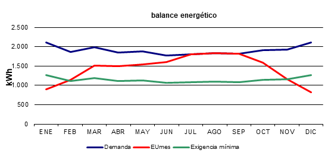

# Balance energetico de la instalacion solar termica

> Relacionado con: [3.2. Edificación, Ocupación y Perfil de Demanda](../Especificaciones/especificacion-antecedentes-y-datos-de-partida.md#h2-32-edificación-ocupación-y-perfil-de-demanda) y [3.4. Equipamiento de Referencia y Fluidos](../Especificaciones/especificacion-antecedentes-y-datos-de-partida.md#h2-34-equipamiento-de-referencia-y-fluidos)

Esta anotacion recoge la tabla de balance energetico mensual y la grafica original extraidas de `Calculos/herramienta_calculo.xlsm`. El objetivo es interpretar la cobertura solar calculada, detectar los meses criticos y relacionar el resultado con la seleccion del interacumulador bivalente desarrollada en [`seleccion-interacumulador-acs-bivalente-lapesa.md`](seleccion-interacumulador-acs-bivalente-lapesa.md).

La hoja `Principal` del Excel esta actualizada con **12 captadores**, **27,96 m2** de superficie de captacion y **2.000 litros** de acumulacion seleccionada. Por tanto, este documento toma ese escenario como balance definitivo de proyecto.

## Datos base extraidos del Excel

| Parametro | Valor |
| --- | ---: |
| Localizacion climatica | Salamanca |
| Viviendas | 10 |
| Personas | 40 |
| Caudal ACS demandado | 1.064 litros/dia |
| Temperatura de ACS | 60 degC |
| Numero de captadores sugerido | 10 |
| Superficie sugerida | 23,3 m2 |
| Volumen sugerido | 1.500 litros |
| Fraccion solar con superficie sugerida | 67,8 % |
| Numero de captadores seleccionado | 12 |
| Superficie resultante | 27,96 m2 |
| Volumen de acumulacion ACS seleccionado | 2.000 litros |
| Relacion V/Sc resultante | 71,5 l/m2 |
| Fraccion solar anual resultante | 75,3 % |

## Tabla mensual de balance energetico

| Mes | Demanda ACS (kWh) | Radiacion en superficie inclinada (kWh/m2) | Fraccion solar mensual | Energia util aportada (kWh) |
| --- | ---: | ---: | ---: | ---: |
| Enero | 2.104 | 73,03 | 43 % | 899 |
| Febrero | 1.866 | 91,80 | 62 % | 1.151 |
| Marzo | 1.990 | 123,79 | 76 % | 1.506 |
| Abril | 1.851 | 127,86 | 81 % | 1.499 |
| Mayo | 1.875 | 130,47 | 82 % | 1.546 |
| Junio | 1.777 | 136,76 | 90 % | 1.602 |
| Julio | 1.798 | 162,92 | 101 % | 1.798 |
| Agosto | 1.837 | 176,54 | 106 % | 1.837 |
| Septiembre | 1.814 | 163,92 | 102 % | 1.814 |
| Octubre | 1.913 | 133,36 | 83 % | 1.583 |
| Noviembre | 1.925 | 94,85 | 60 % | 1.161 |
| Diciembre | 2.104 | 67,99 | 39 % | 823 |
| **Anual** | **22.856** |  | **75,3 %** | **17.219** |

## Grafica original exportada

La grafica muestra tres curvas: demanda mensual, energia util aportada por los captadores y exigencia minima. La energia util se aproxima mucho a la demanda entre julio y septiembre, mientras que en invierno se separa de forma clara y obliga al sistema auxiliar a cubrir una parte significativa del consumo de ACS.

## Interpretacion mensual

El balance presenta dos zonas tecnicamente opuestas:

| Periodo | Lectura tecnica | Consecuencia de diseno |
| --- | --- | --- |
| Enero, febrero, noviembre y diciembre | La radiacion disponible baja y la temperatura de agua fria reduce el salto termico aprovechable. La fraccion mensual cae al 43 %, 62 %, 60 % y 39 %. | El sistema de apoyo debe estar dimensionado para cubrir la demanda en los meses desfavorables sin depender de la aportacion solar. |
| Marzo a junio y octubre | La cobertura solar es alta pero controlada, entre el 76 % y el 90 %. | Es la zona de funcionamiento mas equilibrada: la instalacion reduce consumo auxiliar sin llegar a saturar de forma sistematica la acumulacion. |
| Julio, agosto y septiembre | La fraccion mensual supera ligeramente el 100 %: 101 %, 106 % y 102 %. Ningun mes rebasa el umbral del 110 %. | Es el periodo critico por sobreproduccion moderada. El diseno queda en el limite de los tres meses por encima del 100 %, por lo que conviene mantener protecciones frente a estancamiento. |

## Limitaciones tecnicas principales

La consulta al notebook `Energia_Solar_Termica` confirma tres restricciones que deben revisarse en el balance:

1. **Sobreproduccion mensual absoluta:** ningun mes deberia superar el 110 % de la demanda energetica mensual. En la tabla actualizada, el maximo es **agosto con 106 %**, por lo que no se rebasa este limite.
2. **Sobreproduccion prolongada:** la energia solar no debe superar el 100 % de la demanda en mas de tres meses. El balance tiene exactamente tres meses por encima del 100 %: **julio, agosto y septiembre**. La condicion queda en el limite admisible.
3. **Cobertura renovable anual minima:** la fraccion solar anual resultante es **75,3 %**, superior a la exigencia indicada en la hoja de calculo (**60 %**) y holgada frente al criterio general de cobertura renovable para ACS. El resultado es suficiente sin forzar un escenario de exceso mensual severo.

## Meses criticos

Los meses mas criticos por deficit son **diciembre** y **enero**, con las menores fracciones solares mensuales: 39 % y 43 %. En estos meses la demanda energetica es de 2.104 kWh y la aportacion util baja a 823 kWh y 899 kWh respectivamente.

Los meses mas criticos por exceso son **julio, agosto y septiembre**. La situacion mas desfavorable es **agosto**, porque combina la maxima radiacion mensual de la tabla, 176,54 kWh/m2, con una fraccion solar del 106 %. Este valor no rebasa el limite del 110 %, pero confirma que el periodo estival debe vigilarse por riesgo de estancamiento si baja la demanda real.

## Impacto sobre la seleccion del interacumulador

El interacumulador actua como bufer entre la produccion solar y el consumo real de ACS. Por eso su volumen afecta directamente a la estabilidad del balance:

| Alternativa | Relacion con el balance | Valoracion |
| --- | --- | --- |
| 1.500 litros | Con 10 captadores queda cerca del limite inferior de acumulacion. Con 12 captadores baja a 53,65 l/m2. | Es una opcion fragil para el balance definitivo: reduce la inercia termica y aumenta el riesgo de alcanzar consigna demasiado pronto en verano. |
| 2.000 litros | Con 12 captadores equivale a 71,5 l/m2, dentro de la horquilla recomendada y coherente con la seleccion de catalogo. | Es la opcion adoptada en el Excel actualizado. Mantiene margen de acumulacion suficiente y conserva una fraccion solar anual del 75,3 %. |

La conclusion de proyecto es que el volumen de **2.000 litros** se justifica frente a **1.500 litros** por inercia termica, margen normativo de relacion volumen/superficie y compatibilidad con la gama bivalente seleccionada. Con **12 captadores**, el balance queda por encima de la cobertura exigida y no supera el 110 % en ningun mes.

## Conclusiones

- La instalacion calculada cumple con holgura la cobertura anual, con una fraccion solar resultante del **75,3 %**.
- El punto debil del balance no es el deficit anual, sino el control de la **sobreproduccion estival moderada**.
- **Agosto** es el mes mas critico por exceso, con **106 %** de fraccion mensual, sin superar el limite del 110 %.
- **Diciembre** y **enero** son los meses mas criticos por deficit y determinan la necesidad del sistema auxiliar.
- La seleccion del interacumulador bivalente de **2.000 litros** es tecnicamente mas robusta que la alternativa de 1.500 litros y queda alineada con el balance definitivo de 12 captadores.

## Fuentes de trabajo

- `Calculos/herramienta_calculo.xlsm`, hoja `Principal`.
- NotebookLM `Energia_Solar_Termica` (`62b2af52-7df4-455e-9334-8b10ebd8118d`), consulta tecnica sobre limitaciones de balance, meses criticos e impacto del volumen de acumulacion.
- [`seleccion-interacumulador-acs-bivalente-lapesa.md`](seleccion-interacumulador-acs-bivalente-lapesa.md).
